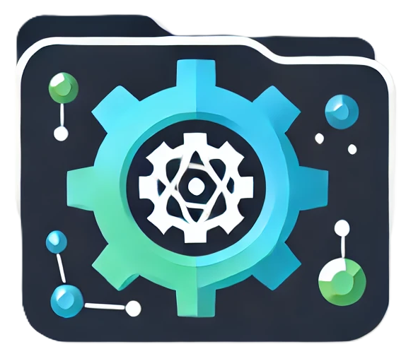

# GEN 

GEN é uma ferramenta para facilar a manipulação de arquivos. O objetivo é manipular esses arquivos e separar os dados para facilitar o cadastro dos produtos. 

## Ferramentas utilizadas

## Funcionalidades

- Manipulação de xml
- Manipulação basica de pdf
- Geração de codigo de barras

## Finalidade
A finalidade do projeto foi o gerenciamento de arquivos para facil manipulação dos dados, se familiarizar com as ferramentas utilizadas afim de aprimorar os conhecimentos basicos.

## Autores

- [@AlanBMC](https://github.com/AlanBMC)

## Status do projeto
 - Finalizado
